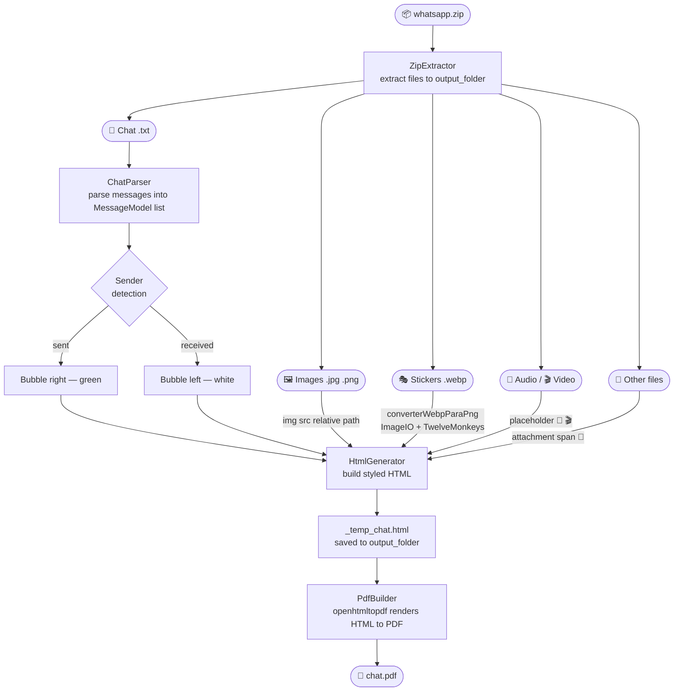

<div align="center">
  
  &nbsp;→&nbsp;
  

  # WhatsApp Backup to PDF
</div>

Converts WhatsApp chat exports (`.zip`) into styled PDF files that preserve the original conversation layout — including images, stickers, audio/video placeholders, and file attachments.

## The backstory

This project was born out of a personal disaster. I lost my entire WhatsApp history to a poorly architected "vibecoded" messaging app. Instead of isolating contact deletions to a separated database, the developer used the WhatsApp API endpoint to delete contacts directly from my phone.
In an instant, two years of messages with my fiancé were gone. That loss sparked a question: "What if I could export everything to a PDF for legal protection (Sue the dev and his company) or safekeeping?" While this tool can't recover what I lost, I built it to ensure others can document their chats for legal purposes, LLM training, or personal archives. 

---

## Features

- **WhatsApp-styled layout** — sent/received bubbles, date separators, author names and timestamps
- **Image rendering** — embeds `JPG`, `PNG` and `GIF` files directly into the PDF
- **Sticker support** — automatically converts `WebP` stickers (including lossless VP8L and transparent VP8X) to PNG before embedding
- **Media placeholders** — audio (`🎵`) and video (`🎬`) files are displayed as descriptive placeholders
- **Generic attachments** — other file types (`PDF`, `DOCX`, etc.) are listed with a paperclip icon (`📎`)
- **Dual format parsing** — supports both Android (`filename (file attached)`) and iPhone (`<attached: filename>`) export formats
- **Omitted media handling** — messages with `<Media omitted>` are displayed with a placeholder
- **Multi-encoding support** — handles UTF-8 and UTF-16 encoded chat files
- **Multi-line messages** — correctly reassembles messages that span multiple lines

---

## Pipeline



---

## Architecture

```
src/main/java/com/whatsappbackuptopdf/
├── Main.java                   # Entry point — orchestrates the full pipeline
├── extractor/
│   └── ZipExtractor.java       # Extracts ZIP archives to the output folder
├── parser/
│   └── ChatParser.java         # Parses .txt exports (Android & iPhone formats)
├── model/
│   └── MessageModel.java       # Data model: date, time, sender, content
└── pdf/
    ├── HtmlGenerator.java      # Converts messages to WhatsApp-styled HTML
    └── PdfBuilder.java         # Renders HTML to PDF via openhtmltopdf
```

---

## Requirements

| Tool | Version |
|---|---|
| Java | 17+ |
| Maven | 3.6+ |

---

## Usage

1. Place your WhatsApp export `.zip` file(s) in the project root directory.

   > To export on Android: open a conversation → tap ⋮ → **More** → **Export chat** → **Include media**

2. Run the application:

   ```bash
   mvn compile exec:java -Dexec.mainClass="com.whatsappbackuptopdf.Main"
   ```

3. The generated PDF will appear in the project root as `whatsapp chat with <contact>.pdf`.

---

## Supported attachment types

| Extension | Behaviour |
|---|---|
| `jpg`, `jpeg`, `png`, `gif` | Rendered as image inline |
| `webp` | Converted to PNG, then rendered as image |
| `mp3`, `ogg`, `aac`, `m4a`, `opus`, `wav` | 🎵 Audio placeholder |
| `mp4`, `avi`, `mov`, `mkv`, `3gp` | 🎬 Video placeholder |
| `<Media omitted>` | 🖼️ Placeholder indicating media was not included in export |
| Any other | 📎 Filename listed as attachment |

---

## Dependencies

| Library | Purpose |
|---|---|
| `com.openhtmltopdf:openhtmltopdf-pdfbox` | HTML → PDF rendering |
| `com.twelvemonkeys.imageio:imageio-webp` | WebP decoding (VP8, VP8L, VP8X) |
